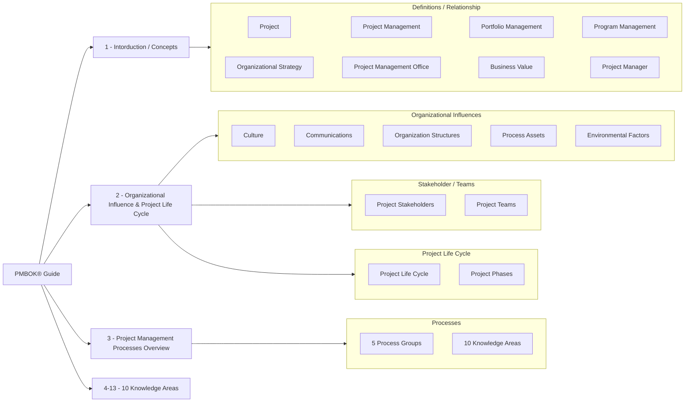

```mermaid
---
Title: PMBOK® Guide
--- 

%%{init: {"theme": "default","logLevel": "info", "htmlLabels": true, "curve": "natural" }}%%

flowchart LR 

P[PMBOK® Guide] --> P01["1 - Intorduction / Concepts"] 
P01 --> Definitions
P --> P02["2 - Organizational Influence & Project Life Cycle"]
P02 --> OrganizationalInfluenceFators
P02 --> StakeholdersTeams
P02 --> ProjectLifeCycle
P --> P03["3 - Project Management Processes Overview"] --> ProjectManagementProcesses
P --> P04["4-13 - 10 Knowledge Areas"]

subgraph Definitions["Definitions / Relationship"]
    direction LR
    P0101[Project]
    P0102[Project Management]
    P0103[Portfolio Management]
    P0104[Program Management]
    P0105[Organizational Strategy] 
    P0106[Project Management Office]
    P0107[Business Value]
    P0108[Project Manager] 

    P0101 ~~~ P0102 ~~~ P0103 ~~~ P0104
    P0105 ~~~ P0106 ~~~ P0107 ~~~ P0108
end

subgraph OrganizationalInfluenceFators["Organizational Influences"]
    direction TB
    P020101[Culture]
    P020102[Communications]
    P020103[Organization Structures] 
    P020104[Process Assets]
    P020105[Environmental Factors]
end

subgraph StakeholdersTeams["Stakeholder / Teams"]
    direction TB
    P020201[Project Stakeholders]
    P020202[Project Teams]
end

subgraph ProjectLifeCycle["Project Life Cycle"]
    direction TB
    P020301[Project Life Cycle]
    P020302[Project Phases]
end

subgraph ProjectManagementProcesses["Processes"]
    direction TB
    P0301[5 Process Groups]
    P0302[10 Knowledge Areas]
end


```