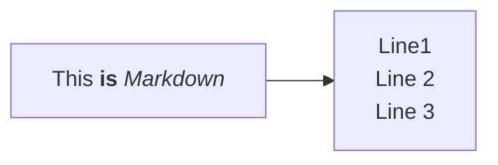

*Ref.*
> [Mermaid Get Started](https://mermaid.js.org/intro/getting-started.html)
> [cdnjs](https://cdnjs.com/libraries/mermaid)

## Steps

- Find the latest mermaid javascript (cdnjs as example):  _https://cdnjs.cloudflare.com/ajax/libs/mermaid/11.5.0/mermaid.min.js_
- Include the following scripts in html page or layout page.

~~~html
<!DOCTYPE html>
<html lang="{{ site.lang | default: "en-US" }}">
<head>
	...
	
	...
</head>
<body>
    ...
    
</body>
</html>
~~~

## Test by adding mermaid code block

~~~html

~~~

~~~mermaid
%%{init: {"flowchart": {"htmlLabels": false}} }%%
flowchart LR
    markdown["`This **is** _Markdown_`"]
    newLines["`Line1
    Line 2
    Line 3`"]
    markdown --> newLines
~~~

## Optional: tips of changing chart style

By default, the chart is rendered based on the site css styles. Sometimes, the style doesn't satisfy requirements. One problem I encountered is, my site background is black and the lines between shapes are also with black color. This made the lines invisible.

To fix this problem, I use css selector to find the rendered objects <pre>. The mermaid markdown code is rendered as the following. 
~~~html
<pre><code class="language-mermaid" data-processed="true">
    <svg ...>...</svg></code></pre>
~~~

Select <pre> using (has) combinator and class "language-mermaid" which is rendered by mermaid. Then change css style. Here's the css I'm using. 
~~~html

~~~

