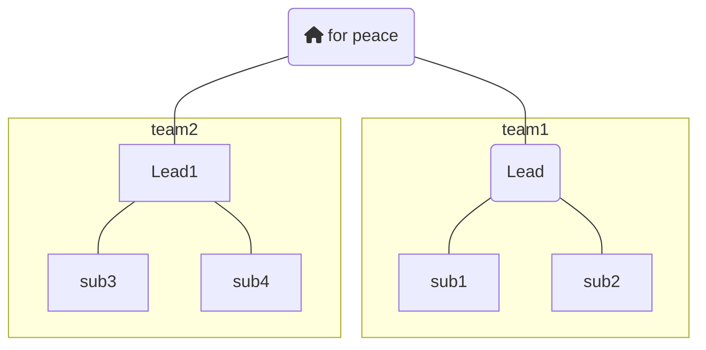

```mermaid
---
Title: Organizational Chart 
--- 

%%{init: {"theme": "default","logLevel": "info", "htmlLabels": true, "curve": "natural" }}%%

flowchart TD

  Head("fa:fa-home for peace")---Lead(Lead)
  Head---Lead1

  subgraph team1
  
  Lead---sub1
  Lead---sub2
  end

  subgraph team2

  Lead1---sub3
  Lead1---sub4
  end

```

