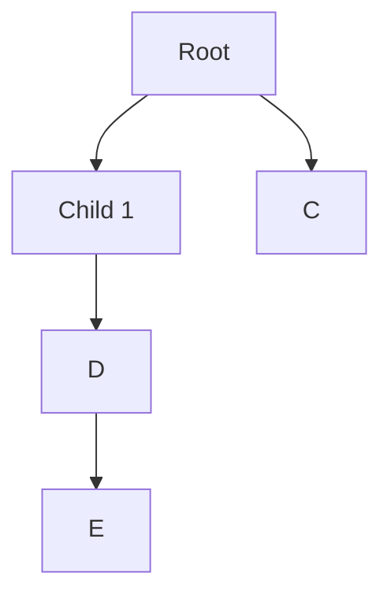

## Mermaid tree diagram

## Install svg-pan-zoom plugin

- Goto https://github.com/bumbu/svg-pan-zoom
- Download "svg-pan-zoom.min.js" file.
- Include the javascript file in web page.
- Call init method.

Sample code block (mermaid chart as example).
> Tip: Mermaid.js often generates SVGs dynamically, so need to wait for them to appear. (DOMContentLoaded)  
> Tip: To change the default svg width as "100%".

~~~html
<head>
    ...
    
    ...
</head>

<body>
    ...
    
</body>
~~~